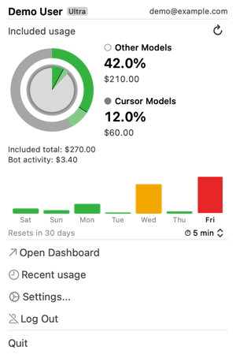
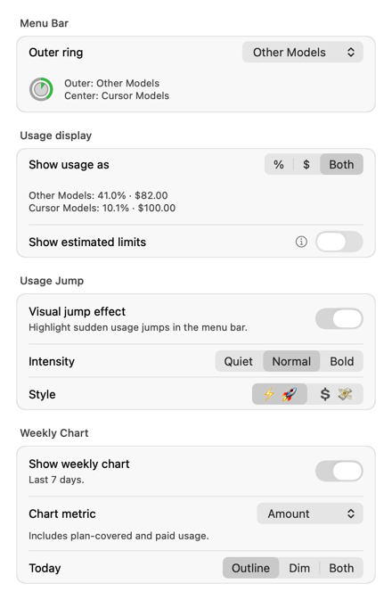
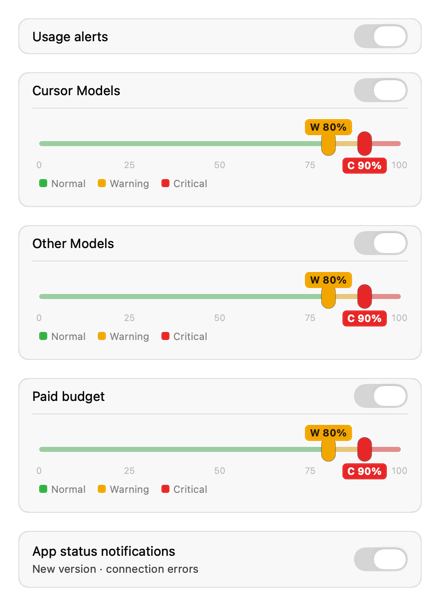
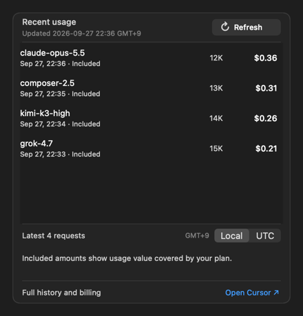
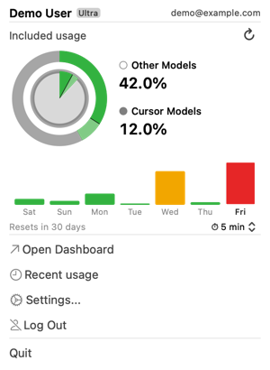
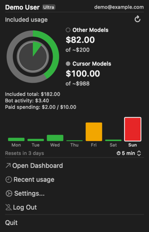
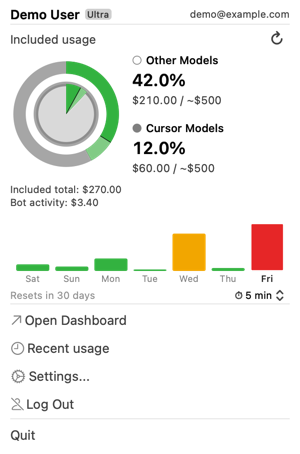
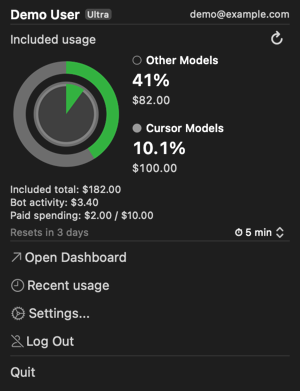

[English](README.md) | [한국어](README.ko.md) | [简体中文](README.zh-CN.md) | **日本語**

<p align="center">
  
</p>

<h1 align="center">CursorMeter</h1>

<p align="center">
  
  
  
  
</p>

[Cursor](https://www.cursor.com/) IDE の使用量をひと目で確認できる、軽量な macOS メニューバーアプリです。ブラウザーのタブを開く必要はありません。

エディター内の拡張機能とは異なり、CursorMeter は独立したネイティブ macOS アプリとして動作します。IDE を開いていなくてもメニューバーに常駐し、Keychain により再起動後もログイン状態を維持します。

Cursor は [2026 年 2 月 11 日、個人向けプランに 2 つの使用枠を導入すると発表しました](https://cursor.com/blog/increased-agent-usage)。CursorMeter は現在、Cursor が報告する使用率に従い、**Cursor Models** と **Other Models** を分けて表示します。

2 つの使用枠のメーターは現在、**中央の円グラフと外側のリングという 1 種類のレイアウト**に対応しています。Settings → Display で両者の配置を入れ替え、ポップオーバーの表示をパーセント、ドル金額、または両方から選べます。今後のアップデートでは、ほかのレイアウトも提供する予定です。

## 機能

- **2 つの使用枠をひと目で確認** — 対応する個人向け有料プランでは、中央の円グラフに Cursor Models、外側のリングに Other Models を表示します。それぞれの領域に固有のパーセントと色があり、Display 設定で外側に置く使用枠を選べます。データが欠けている場合は、取得できない状態のまま表示します。
- **ポップオーバーで今日の使用分を表示** — 記録されたプラン内利用額をもとに、今日の使用分の割合を明るい色で推定表示します。日付の区切りは韓国標準時（UTC+9）の午前 0 時です。大きな円にポインターを重ねると意味を確認できます。対応関係が確認でき、検証済みのデータがある場合にのみ強調表示し、どちらかの使用枠が 100% に達すると非表示にします。全体の塗りつぶし率とアラートは引き続き Cursor が報告するパーセントを使います。
- メニューバーから使用量とリセット日を確認できます。使用枠が 1 つのプランでは、データがある場合にリクエスト数も表示します
- **わかりやすい使用量アラート** — Cursor Models、Other Models、および対象となる追加課金の予算に、それぞれ警告/重大のしきい値を設定できます（初期値：80%/90%）。通知には実際の使用量と設定したレベルを表示します。同じ更新で警告と大幅な増加が発生した場合は、簡潔な 1 件の通知にまとめます。
- **使用量急増エフェクト** — 中程度の増加ではメニューバーのアイコンが ⚡、大幅な増加では 🚀 に一時的に変わり、急増を見逃しにくくします。強度は 3 段階（Quiet / Normal / Bold）、アイコンのスタイルは ⚡/🚀 または 💲/💸 から選べます。Bold では第 2 段階の急増時に macOS 通知も表示し、使用量アラートの対象や全体スイッチとは独立して動作します。2 つの使用枠を持つプランでは、+5/+15 パーセントポイントの変化に加え、プラン内利用額 $0.05/$0.30 の検出感度を維持します。メッセージには測定対象を示し、増加の原因を推測しません。
- **週間使用量グラフ**（全プラン）— 直近 7 日間を棒グラフで表示します。Settings → Display で **Amount**（初期値）または **Usage units** を選べます。棒の高さ、色、ホバー時のツールチップは同じ指標を使います。Amount はプランでカバーされる利用分とオンデマンド利用分の金額を含み、追加請求額だけを表すものではありません。金額データがない場合は、重み付きの使用単位（`requestsCosts`）に切り替わります。今日の強調方法も設定できます（Outline / Dim others / Both）。
- **週間グラフの鮮度表示** — 一時的な失敗時は前回のグラフを保持します。2 回連続で失敗すると日付付きの最終更新ラベルを表示し、履歴がまだ読み込まれていない場合は短い再試行メッセージを表示します。既存の更新スケジュールで自動的に再試行します。
- **使用量の詳細** — ポップオーバーでは 2 つの使用枠のメーターを大きく表示し、パーセント、記録された米ドル金額、または両方を確認できます。形式は Display 設定で選びます。任意の推定上限は初期状態でオフになっており、対応する使用量と金額のデータが推定を裏付ける場合にのみ表示します。非公式の推定値であり、プランで保証される利用枠ではありません。円全体の塗りつぶし率とアラートには、常に報告されたパーセントを使います。オンデマンド支出と Bot の利用分は別に扱います。
- **最近の使用履歴** — Settings → Usage に最新 30 件までのリクエストを表示し、モデル、時刻、種類、トークン数、米ドル金額を確認できます。Included の金額はプランでカバーされる利用分であり、追加請求ではありません。**Local**（この Mac のタイムゾーン、初期値）または **UTC** を選択でき、**Open Cursor** から全履歴と請求ダッシュボードを開けます。
- **この Mac に保存** — サイズを制限した 1 つのスナップショットを再起動後も保持し、元のキャッシュ日時を表示します。更新に失敗しても、利用条件を満たす保存済みデータは保持します。キャッシュと更新スケジュールは Mac ごとに独立しています。ローカル履歴アーカイブやデバイス同期サービスではありません。
- **更新処理の共有** — ポップオーバーと Usage タブは 1 つの進行中の更新を共有します。受け付けた更新の開始間隔は最低 3 秒で、進捗表示は少なくとも 1.3 秒間続きます。リストには既存の週間イベントの応答を再利用します。タブを開いたり、タイムゾーンを変更したりしてもリクエストは発生しません。
- 2 つの使用枠を持つプランでも、メニューバーのアイコンは初期状態ではコンパクトなままです。Settings → Display の **Show percentages** をオンにすると、円の横に両方の使用率を表示します。上段が外側の使用枠、下段が中央の使用枠です。ホバーすると引き続き両方の名称を表示し、クリックすると詳細を確認できます。使用枠が 1 つのプランでは、アイコンのみ、分数、パーセントの各モードと保存済みの設定を維持します。
- 設定画面（更新間隔、通知しきい値、メニューバーの表示形式、急増エフェクトの強度、週間グラフのスタイル、最近の使用履歴）
- ログイン時の起動に対応
- アプリ内でのアップデート確認
- **設定不要のログイン** — 同じ Mac 上の Cursor IDE にログイン済みなら、CursorMeter が自動的に接続します（別途ログインする必要はありません）。IDE にまだログインしていない場合はポップオーバーで案内します。1 回のクリックで IDE を開き、ログインが完了するとアプリが自動接続します。ログアウトすると、再接続するまで IDE への自動接続を停止します。
- **ブラウザー（WebView）ログインは非推奨** — 引き続き利用できます（Google、GitHub、Enterprise SSO）が、初期状態では非表示です。Settings → General → "Enable browser login" で明示的に有効にできます。Cursor IDE アプリがインストールされていない場合に限り自動的に再表示されるため、少なくとも 1 つの接続方法が常に用意されます。
- 自動更新間隔を設定可能（1/2/5/15 分）
- **アクティビティに応じた更新** — ローカルの Cursor の動作を検知すると、次の定期ポーリングを待たずに約 1 分以内に更新します。定期ポーリングは、ほかのデバイスでの利用分も含めてフォールバックとして引き続き使われます。表示までの時間は Cursor の報告遅延に左右されます。Settings → Refresh → "Refresh on Cursor activity" で切り替えられます。
- Keychain による認証情報の保存
- 純粋な AppKit 製、外部依存なし

## セキュリティ

- 外部依存なし（macOS SDK のみ）
- 2 段階の WebView ホスト許可リスト（完全一致 + サフィックス一致）を使用し、ナビゲーションのアクションとレスポンスの両方で `https` を強制
- ログインセッションの永続化前に必須 Cookie を検証
- GitHub Releases API から取得したすべての URL をホスト検証してから `NSWorkspace.open` で開く
- `URLSessionConfiguration.ephemeral` を使用（HTTP ディスクキャッシュなし）。サイズを制限した最近の使用履歴/請求周期のスナップショットと、通知送信に成功したアラートの記録は別途保存
- Keychain による認証情報の保存

脅威モデルと報告ポリシーの詳細は [`SECURITY.md`（英語）](SECURITY.md) を参照してください。

## 動作要件

- macOS 14（Sonoma）以降
- Apple Silicon または Intel Mac（Intel には `x86_64` ZIP を含むリリースが必要）

## インストール

### クイックインストール（推奨）

Apple Silicon と Intel Mac で同じコマンドを実行できます。スクリプトが Mac を判別して対応するビルドをダウンロードし、チェックサムが公開されていれば検証したうえで、`/Applications` にインストールします。

```bash
curl -fsSL https://raw.githubusercontent.com/WoojinAhn/CursorMeter/main/Scripts/install.sh | bash
```

Intel へのインストールには、`x86_64` ZIP を含むリリースが必要です。最新リリースにまだ含まれていない場合、既存のアプリを置き換えずにスクリプトを終了します。

### 手動インストール

1. [Releases](https://github.com/WoojinAhn/CursorMeter/releases) から Mac に対応する ZIP をダウンロードします。**Apple Silicon：** `CursorMeter-<version>.zip`、**Intel：** `CursorMeter-<version>-x86_64.zip`（リリースに含まれる場合）。
2. 任意 — リリースに `.zip.sha256` ファイルが含まれていれば、ダウンロード内容を検証できます。
   `shasum -a 256 -c CursorMeter-<version>.zip.sha256`
   Intel では `CursorMeter-<version>-x86_64.zip.sha256` を使ってください。
   （破損したファイルや誤ったファイルを検出するための確認であり、配布者の署名を検証するものではありません。アプリは ad-hoc 署名です。手順 4 を参照してください。）
3. 解凍して `CursorMeter.app` を `/Applications` にドラッグします
4. 初回起動時、macOS がアプリをブロックすることがあります（未署名）。次の方法で開けます。
   - アプリを**右クリック** → **Open** → ダイアログで **Open** をクリック
   - または System Settings → Privacy & Security → **Open Anyway** をクリック

## ソースからビルド

```bash
# ビルドして .app バンドルを作成（ad-hoc 署名）
bash Scripts/package_app.sh

# インストール
cp -r CursorMeter.app /Applications/
```

Swift 6.0+ と Xcode が必要です。特定のアーキテクチャ向けにビルドするには、`BUILD_ARCH=arm64 bash Scripts/package_app.sh` または `BUILD_ARCH=x86_64 bash Scripts/package_app.sh` を実行します。どちらも `CursorMeter.app` を生成するため、別々のディレクトリに保存する場合は `APP_OUTPUT_DIR` を設定してください。

## テスト

```bash
swift test    # 全テストを実行（Xcode が必要）
```

テストスイートは、ビューモデルのロジック（認証情報チェーン、古いデータの検出、しきい値、急増イベント）、カスタムコントロール（2 つのつまみを持つ範囲スライダー）、通知ルール、ログの秘匿化、および URLProtocol モックを使った API クライアントの統合をカバーします。手動テストのシナリオは [test-checklist.md](docs/test-checklist.md) を参照してください。

## 免責事項

このアプリは Cursor の**公開仕様のない内部エンドポイント**を複数使用しています（使用量、認証、ダッシュボード API。全一覧は [`docs/API_REFERENCE.md`](docs/API_REFERENCE.md) を参照）。これらは予告なく変更されたり、アクセスが遮断されたりする可能性があります。

## コントリビュート

不具合やアイデアがあれば、[issue を作成](https://github.com/WoojinAhn/CursorMeter/issues)してください。フィードバックや提案はいつでも歓迎します。現在、Pull Request は受け付けていません。

## スクリーンショット

<table>
  <tr>
    <th align="center">2 つの使用枠を 1 つのメーターで</th>
    <th align="center">表示の選択肢</th>
  </tr>
  <tr>
    <td align="center" valign="top"><a href="docs/screenshots/popover-weekly.png"></a></td>
    <td align="center" valign="top"><a href="docs/screenshots/settings-display.png"></a></td>
  </tr>
  <tr>
    <td align="center">両方の使用枠と 1 週間の利用状況。</td>
    <td align="center">数値、配置、エフェクトを選択。</td>
  </tr>
  <tr>
    <th align="center">個別のアラート</th>
    <th align="center">最近のリクエスト</th>
  </tr>
  <tr>
    <td align="center" valign="top"><a href="docs/screenshots/settings-alerts.png"></a></td>
    <td align="center" valign="top"><a href="docs/screenshots/settings-usage.png"></a></td>
  </tr>
  <tr>
    <td align="center">使用枠ごとに警告と重大レベルを設定。</td>
    <td align="center">最大 30 件をローカル時刻または UTC で表示。</td>
  </tr>
</table>

<p align="center"><em>デモデータを使った現在のネイティブ AppKit 画面です。モデル名、金額、推定上限は例であり、プランの利用権を示すものではありません。画像をクリックすると原寸で表示します。</em></p>

<details>
  <summary>パーセント、ドル金額、任意の推定上限</summary>
  <table>
    <tr><th>パーセント</th><th>ドル金額</th><th>両方と推定値</th></tr>
    <tr>
      <td valign="top"><a href="docs/screenshots/popover-percent.png"></a></td>
      <td valign="top"><a href="docs/screenshots/popover-dollars.png"></a></td>
      <td valign="top"><a href="docs/screenshots/popover-estimated.png"></a></td>
    </tr>
  </table>
  <p>推定値は初期状態でオフです。対応する使用量と金額の観測値が推定を裏付ける場合にのみ表示され、円やアラートには影響しません。<a href="docs/screenshots/estimated-limits-help.png">アプリ内の説明を見る。</a></p>
</details>

<details>
  <summary>週間グラフをオフにしたポップオーバー</summary>
  <p align="center">
    <a href="docs/screenshots/popover.png"></a>
  </p>
</details>

## ライセンス

MIT
