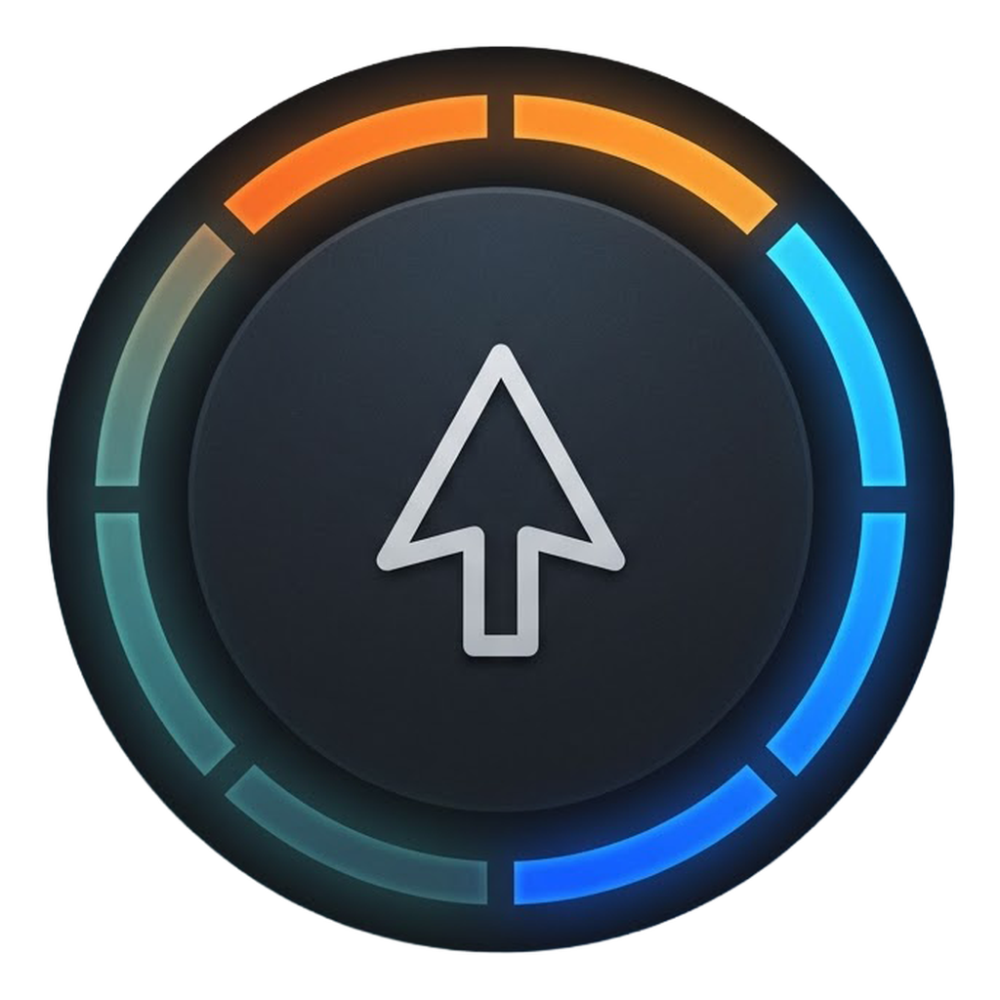
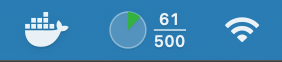
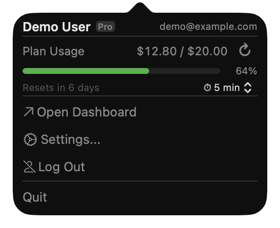
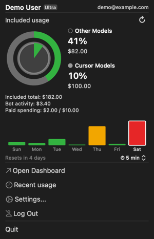
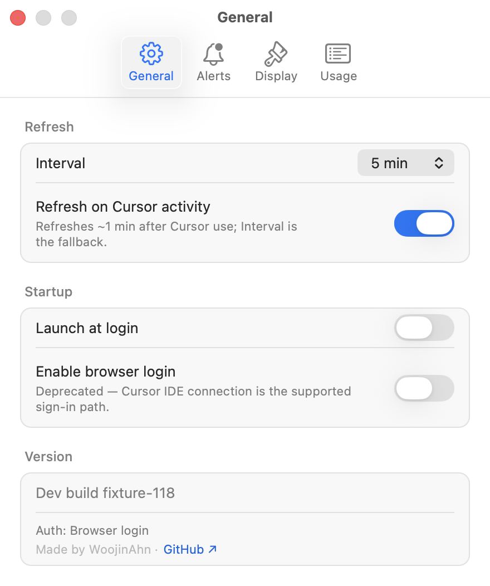

[English](README.md) | **한국어**

<p align="center">
  
</p>

<h1 align="center">CursorMeter</h1>

<p align="center">
  
  
  
  
</p>

[Cursor](https://www.cursor.com/) IDE의 사용량을 macOS 메뉴바에서 한눈에 모니터링하는 경량 앱입니다. 브라우저 탭을 열 필요 없이 확인할 수 있습니다.

에디터 내 확장과 달리, CursorMeter는 네이티브 macOS 앱으로 독립 실행됩니다. IDE를 열지 않아도 메뉴바에서 항상 확인 가능하며, Keychain 기반으로 재시작 후에도 로그인이 유지됩니다.

## 주요 기능

- 메뉴바 게이지 링 아이콘으로 사용량 시각화 (초록 → 노랑 → 빨강 색상 단계)
- 메뉴바에서 빌링 사용량, 요청 횟수, 리셋 날짜 확인
- 사용량 임계치 도달 시 macOS 알림 (기본값: 80%/90%, 커스텀 가능)
- **사용량 점프 이펙트** — 사용량이 한 번에 크게 올라가면 메뉴바 아이콘에 ⚡(중간 점프) 또는 🚀(Max 모드급 점프)가 잠시 표시되어, 갑작스런 증가를 놓치지 않게 합니다. 강도 3단계(Quiet / Normal / Bold)와 글리프 스타일(⚡/🚀 또는 💲/💸) 선택 가능, Bold + 큰 점프 조합에선 macOS 알림도 함께 띄움.
- **주간 사용량 차트** (모든 플랜) — 최근 7일 막대 그래프를 설정 → Display에서 **Amount**(기본값) 또는 **Usage units** 기준으로 선택할 수 있습니다. 막대 높이·색상·툴팁은 같은 지표를 사용합니다. 금액은 추가 청구액뿐 아니라 구독에 포함된 사용 가치까지 합산하며, 금액 데이터가 없으면 가중 사용량 단위(`requestsCosts`)로 표시합니다. 오늘 강조 스타일 3가지(Outline / Dim / Both) 선택 가능.
- **주간 차트 갱신 상태** — 일시적 조회 실패 시 마지막 차트를 유지합니다. 두 번 연속 실패하면 마지막 갱신 날짜와 시각을 표시하고, 아직 이력을 받지 못했다면 작은 재시도 안내를 표시합니다. 기존 새로고침 일정으로 자동 재시도합니다.
- **최근 사용 내역** — 설정 → Usage에서 최근 요청 최대 30건의 모델·시각·유형·토큰·달러 금액을 확인할 수 있습니다. Included 금액은 추가 청구액이 아니라 요금제에 포함된 사용 가치입니다. **Local**(기본값: 이 Mac의 시간대)과 **UTC**를 선택할 수 있으며, **Open Cursor**로 전체 내역과 청구 대시보드를 엽니다.
- **이 Mac에 저장** — 최대 30건의 스냅샷 하나를 재시작 후에도 유지하며 원래 캐시 날짜와 시각을 표시합니다. 갱신에 실패해도 사용 가능한 저장 내역은 유지됩니다. Mac마다 캐시와 갱신 일정이 별도로 동작하며, 전체 이력 보관이나 기기 간 동기화 기능은 아닙니다.
- **공통 새로고침** — 팝오버와 Usage 탭은 진행 중인 갱신 하나와 새 갱신 시작 사이의 최소 3초 간격을 공유하며, 진행 피드백을 최소 1.3초 표시합니다. 목록은 기존 주간 이벤트 응답을 재사용합니다. 탭을 열거나 시간대를 바꾸는 동작은 요청을 보내지 않습니다.
- 메뉴바 표시 모드: 아이콘만, 분수(사용/한도), 퍼센트(%) 중 선택
- 설정 UI (새로고침 간격, 알림 임계치, 메뉴바 표시 형식, 점프 이펙트 강도, 주간 차트 스타일, 최근 사용 내역)
- 로그인 시 자동 실행 지원
- 앱 내 업데이트 확인
- **제로 설정 로그인** — 같은 Mac의 Cursor IDE에 로그인되어 있으면 별도 로그인 없이 자동 연결됩니다. IDE에 로그인되어 있지 않으면 팝오버가 안내합니다: 클릭 한 번으로 IDE가 열리고, 로그인을 마치는 순간 앱이 스스로 연결됩니다. 로그아웃하면 자동 IDE 연결도 재연결 전까지 일시 중지됩니다.
- **브라우저(WebView) 로그인은 deprecated** — 여전히 동작하지만(Google, GitHub, Enterprise SSO), 설정 → General → "Enable browser login" 옵트인 뒤로 숨겨졌습니다. Cursor IDE 앱이 설치되어 있지 않은 경우에만 자동으로 다시 노출되므로, 연결 경로가 없어지는 일은 없습니다.
- 자동 새로고침 (1/2/5/15분 간격 선택)
- **활동 기반 새로고침** — 이 Mac의 Cursor 활동을 감지하면 다음 폴링을 기다리지 않고 약 1분 내에 갱신을 요청합니다. 다른 기기의 사용량을 포함해 간격 폴링이 fallback으로 계속 동작합니다. 실제 내역 반영 시점은 Cursor의 보고 지연에 영향을 받습니다. 설정 → Refresh → "Refresh on Cursor activity"에서 켜고 끌 수 있습니다.
- Keychain 기반 인증 정보 저장
- 외부 의존성 없는 순수 AppKit 기반

## 보안 특성

- 외부 의존성 0개 (macOS SDK만 사용)
- 2계층 WebView 호스트 화이트리스트 (exact + suffix), navigation action / response 양쪽에서 `https` 스킴까지 검증
- 로그인 세션 저장 전 필수 쿠키 검증
- GitHub Releases API에서 받은 URL은 호스트 검증 후 `NSWorkspace.open` 호출
- `URLSessionConfiguration.ephemeral` (HTTP 디스크 캐시 없음); 최근 사용 내역 스냅샷은 별도 저장
- Keychain 기반 인증 정보 저장

전체 위협 모델과 신고 정책은 [`SECURITY.ko.md`](SECURITY.ko.md) 참조.

## 요구사항

- macOS 14 (Sonoma) 이상
- Apple Silicon 또는 Intel Mac (Intel은 `x86_64` ZIP이 포함된 릴리스 필요)

## 설치

### 빠른 설치 (권장)

Apple Silicon과 Intel Mac에서 같은 명령어를 실행하면 됩니다. 스크립트가 Mac을 자동 판별해 맞는 빌드를 다운로드하고, 체크섬이 게시되어 있으면 검증한 뒤 `/Applications`에 설치합니다.

```bash
curl -fsSL https://raw.githubusercontent.com/WoojinAhn/CursorMeter/main/Scripts/install.sh | bash
```

Intel 설치에는 `x86_64` ZIP이 포함된 릴리스가 필요합니다. 최신 릴리스에 해당 파일이 아직 없으면 기존 앱을 교체하지 않고 중단합니다.

### 수동 설치

1. [Releases](https://github.com/WoojinAhn/CursorMeter/releases)에서 Mac에 맞는 ZIP 다운로드: **Apple Silicon:** `CursorMeter-<version>.zip`; **Intel:** `CursorMeter-<version>-x86_64.zip` (릴리스에 포함된 경우).
2. (선택) 릴리즈에 `.zip.sha256` 자산이 있으면 다운로드를 확인할 수 있습니다:
   `shasum -a 256 -c CursorMeter-<version>.zip.sha256`
   Intel은 대신 `CursorMeter-<version>-x86_64.zip.sha256` 파일을 사용합니다.
   (손상되거나 잘못된 파일을 걸러냅니다. 배포자 서명이 아닙니다 — 앱은 ad-hoc 서명이므로 4단계 참고.)
3. 압축 해제 후 `CursorMeter.app`을 `/Applications`로 이동
4. 최초 실행 시 macOS가 차단할 수 있습니다 (미서명 앱). 우회 방법:
   - 앱을 **우클릭** → **열기** → 대화상자에서 **열기** 클릭
   - 또는: 시스템 설정 → 개인정보 보호 및 보안 → **확인 없이 열기** 클릭

## 소스에서 빌드

```bash
# 빌드 + .app 번들 생성 (ad-hoc 서명)
bash Scripts/package_app.sh

# 설치
cp -r CursorMeter.app /Applications/
```

Swift 6.0+ 및 Xcode가 필요합니다. 특정 아키텍처로 빌드하려면 `BUILD_ARCH=arm64 bash Scripts/package_app.sh` 또는 `BUILD_ARCH=x86_64 bash Scripts/package_app.sh`를 실행합니다. 둘 다 `CursorMeter.app`을 생성하며, `APP_OUTPUT_DIR`을 지정하면 서로 다른 디렉터리에 보관할 수 있습니다.

## 테스트

```bash
swift test    # 전체 테스트 실행 (Xcode 필요)
```

테스트 스위트는 뷰모델 로직(인증 체인, stale 감지, 임계치, 점프 이벤트), 커스텀 컨트롤(듀얼썸 range slider), 알림 규칙, 로그 마스킹, URLProtocol mock 기반 API 클라이언트 통합 테스트를 다룹니다. 수동 테스트 항목은 [test-checklist.md](docs/test-checklist.md) 참고.

## 주의사항

이 앱은 Cursor의 **비공식 내부 엔드포인트** (usage, auth, dashboard API — 전체 목록은 [`docs/API_REFERENCE.md`](docs/API_REFERENCE.md) 참조)를 사용합니다. 해당 엔드포인트는 사전 고지 없이 변경되거나 차단될 수 있습니다.

## 기여하기

버그를 발견하셨거나 아이디어가 있으신가요? [이슈를 열어주세요](https://github.com/WoojinAhn/CursorMeter/issues) — 피드백과 제안은 언제나 환영합니다. 현재 Pull Request는 받지 않습니다.

## 스크린샷

<table>
  <tr>
    <th align="center">메뉴바</th>
    <th align="center">팝오버</th>
    <th align="center">주간 차트</th>
    <th align="center">설정</th>
  </tr>
  <tr>
    <td align="center" valign="top"></td>
    <td align="center" valign="top"></td>
    <td align="center" valign="top"></td>
    <td align="center" valign="top"></td>
  </tr>
</table>

## 라이선스

MIT
